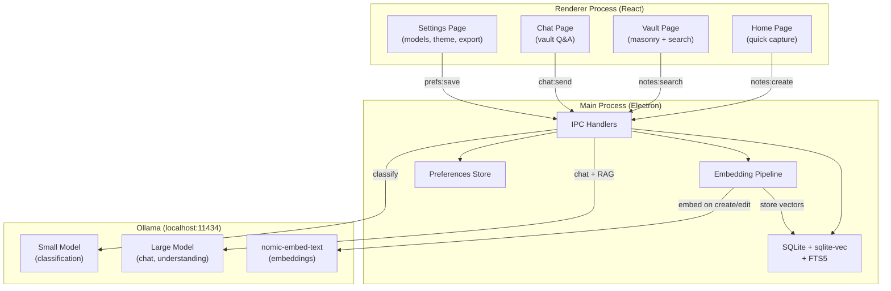
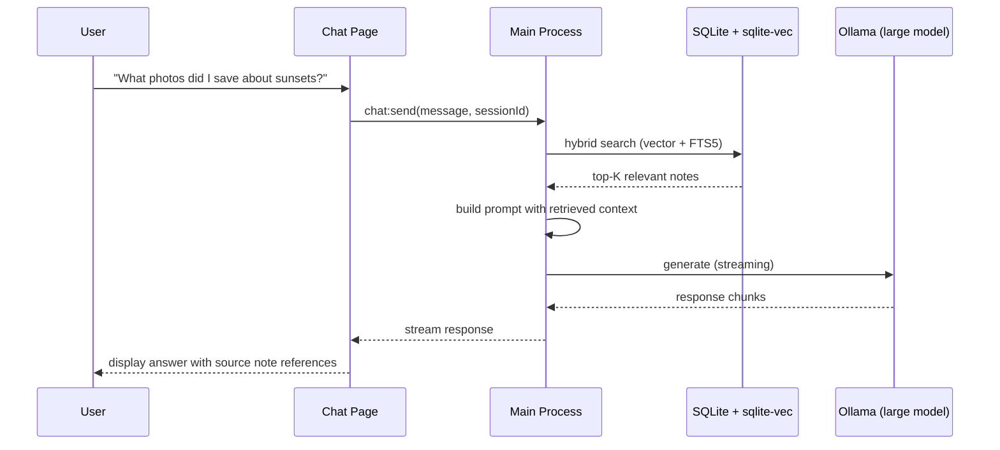

# feat: RINGS v2 — smarter agent, memory engine, chat, brand system, and local-first features

## Summary

Upgrade RINGS from a classification-only vault into an intelligent local-first personal knowledge system. Add a memory engine (sqlite-vec + Ollama embeddings) that powers both semantic search and a new chat page, upgrade the agent from a 3b classifier to a dual-model architecture (fast classifier + smart conversationalist), establish a brand guidelines document that codifies the app's warm editorial identity, and ship local-first features including theme customization, working search, and Electron optimizations.

---

## Problem Frame

RINGS has a solid foundation — Electron + React + SQLite + Ollama — but the AI is limited to note classification, the search bar is non-functional, settings don't persist, and there's no way to interact with vault contents beyond browsing. The app needs to become genuinely useful as a personal knowledge tool: users should be able to chat with their vault, find things semantically, and trust the agent to understand their content. The visual identity is good but inconsistently applied, with no codified brand system to maintain quality as features grow.

---

## Requirements

**Agent and intelligence**

- R1. The agent uses a larger model (8b+) for content understanding and conversation, while retaining a fast small model for note classification
- R2. A memory engine stores vector embeddings of all vault content using sqlite-vec and nomic-embed-text via Ollama
- R3. Notes are automatically embedded on creation and re-embedded on edit
- R4. Hybrid retrieval combines vector similarity (sqlite-vec) and keyword search (SQLite FTS5) for query answering

**Chat page**

- R5. A new Chat page lets users ask questions about their vault content and get contextual answers
- R6. Chat uses RAG — retrieves relevant notes via the memory engine, injects them as context, and generates answers with the larger model
- R7. Chat history persists locally in SQLite across sessions
- R8. The agent can create and edit notes from natural language in the chat interface

**Brand and UI**

- R9. A brand guidelines markdown document defines the color system, typography scale, spacing, radius tokens, shadow system, motion principles, and iconography rules
- R10. AGENTS.md links to the brand guidelines and establishes project conventions
- R11. All existing pages and components are updated to match the brand guidelines consistently
- R12. The motion arc animation on the Home page send action is removed

**Electron optimization**

- R13. Electron window configuration uses native vibrancy/background material where supported
- R14. Motion library usage is audited — remove unused imports (arc), reduce bundle by using only needed features

**Local-first features**

- R15. Search in the Vault page actually filters notes by content, title, and type using FTS5
- R16. Settings persist to SQLite and include model selection, theme choice, and notification preferences
- R17. Theme customization supports at least light mode (current) and dark mode, with colors derived from the brand system
- R18. Export vault produces a downloadable archive (JSON with base64-encoded images) of all user data

---

## Key Technical Decisions

**Dual-model architecture:** Use the existing small model (llama3.2:3b or similar) for fast note classification on the Home page, and a larger model (llama3.1:8b, qwen2.5:7b, or gemma3:12b — user's choice from installed models) for chat and understanding. This avoids slowing down the quick-capture flow while enabling deeper reasoning in chat. The Settings page exposes model selection for both roles.

**sqlite-vec for vector storage:** Embeddings live in the same SQLite database as notes, using sqlite-vec as a loadable extension. This matches the existing data architecture (better-sqlite3), avoids a second database, and is validated by KnowNote — a near-identical Electron + React + sqlite-vec + Ollama app. The alternative (LanceDB) offers richer query APIs but adds a separate dependency and data store.

**nomic-embed-text for embeddings:** 274MB model, 768 dimensions, well-tested with sqlite-vec and widely adopted in the Ollama community. Pulled automatically on first use if not present.

**FTS5 for keyword search:** SQLite's built-in full-text search, zero additional dependencies. Combined with sqlite-vec vector search for hybrid retrieval — research shows hybrid outperforms either signal alone.

**Context window management:** For chat with smaller models (8K-32K context), implement a compression trigger at ~70% context fill. The oldest conversation turns are summarized into a single block by the same local model. Summaries are stored as episodic memory in SQLite for future sessions.

**Brand reference: warm editorial, not AI slop.** The brand guidelines codify RINGS' existing direction (Roboto Serif, stone/olive palette, rounded shapes) and sharpen it with Anthropic's own frontend aesthetics guidance — avoiding Inter, pure white backgrounds, and purple gradients. Shadows use warm tones at low opacity rather than pure black. Motion follows the 200ms micro / 300ms page / 600ms emphasis timing scale with GPU-only properties (transform, opacity).

---

## High-Level Technical Design

---

## Scope Boundaries

### In scope

- Everything listed in Requirements R1-R18
- Brand guidelines document creation
- AGENTS.md creation
- UI polish pass on all existing components using brand tokens

### Deferred to Follow-Up Work

- Voice input / audio notes
- Note sharing or collaboration
- Mobile companion app
- GraphRAG (knowledge graph over notes) — upgrade path once flat RAG is proven
- Ollama model auto-download management UI
- Markdown/rich-text note type
- Calendar or timeline view of notes
- Tags or categories system beyond AI classification

---

## Implementation Units

### U1. Brand guidelines document and AGENTS.md

**Goal:** Establish the design system foundation that all subsequent UI work references.

**Requirements:** R9, R10

**Dependencies:** None

**Files:**
- `docs/BRAND_GUIDELINES.md` (create)
- `AGENTS.md` (create)

**Approach:** Define the complete brand system — color tokens (background #f9f8f6, foreground #1a1a1a, accent #6b7c3f, border #e5e0d8, surface white, plus semantic tokens for error/success/warning), typography scale (Roboto Serif Variable with defined size/weight/tracking per role — display, heading, body, caption, UI label), spacing scale (8px base: 4/8/12/16/24/32/48/64), radius tokens (sm 8px, md 12px, lg 16px, xl 24px, full 9999px), shadow system (warm-tinted shadows using stone-900 at low opacity), motion principles (100ms snap / 200ms micro / 300ms page / 600ms emphasis, GPU-only properties, spring configs for interactive elements), and icon guidelines (HugeIcons, stroke weight 1.5, sizes 16/20/24). AGENTS.md references the brand doc and sets project conventions (local-only, Ollama, no cloud).

**Patterns to follow:** Raycast's design system structure (foundations → components → patterns → motion). Anthropic's frontend aesthetics guidance for the warm editorial direction.

**Test scenarios:**
- Test expectation: none — documentation only

**Verification:** Both documents exist, AGENTS.md links to brand guidelines, brand guidelines cover all ten sections (color, typography, spacing, radius, shadow, motion, iconography, components, dark mode, do/don't).

---

### U2. Database schema — embeddings, FTS5, chat history, preferences

**Goal:** Extend the SQLite schema to support vector search, full-text search, chat sessions, and persistent settings.

**Requirements:** R2, R4, R7, R15, R16

**Dependencies:** None

**Files:**
- `src/main/database.ts` (modify)
- `src/preload/index.ts` (modify)
- `src/preload/index.d.ts` (modify)

**Approach:** Add sqlite-vec as a loadable extension via better-sqlite3's `loadExtension()`. Create tables: `note_embeddings` (note_id, embedding vec_f32(768)), `note_fts` (FTS5 virtual table on notes.content + notes.title), `chat_sessions` (id, title, created_at, updated_at), `chat_messages` (id, session_id, role, content, created_at), `chat_summaries` (session_id, content, covers_through_message_id), `preferences` (key TEXT PRIMARY KEY, value TEXT). Build FTS index entries programmatically in createNote/updateNote/deleteNote rather than via triggers — this is necessary because task content lives in a separate `tasks` table and triggers on `notes` alone would miss it. Concatenate note content + title + task text for the FTS entry. Add IPC handlers for search, chat CRUD, and preferences.

**Patterns to follow:** KnowNote's sqlite-vec integration pattern. Existing `database.ts` transaction style with prepared statements.

**Test scenarios:**
- Creating a note triggers FTS5 index update — searching for a word in the note content returns that note
- Updating a note content updates the FTS5 index
- Deleting a note removes its FTS5 entry and embedding row
- Preferences round-trip: save a key-value pair, read it back, get the same value
- Chat session CRUD: create session, add messages, retrieve session with messages ordered by created_at
- sqlite-vec extension loads without error on macOS

**Verification:** All CRUD operations work through IPC. FTS5 searches return results. Preferences persist across app restart.

---

### U13. Migrate Ollama API calls from renderer to main process

**Goal:** Move all Ollama HTTP calls from the renderer process to the main process via IPC, eliminating CORS issues and securing the API surface.

**Requirements:** R1, R2, R4, R5

**Dependencies:** U2

**Files:**
- `src/main/ollama.ts` (create)
- `src/main/index.ts` (modify)
- `src/renderer/src/lib/ollama.ts` (modify — becomes IPC wrapper)
- `src/preload/index.ts` (modify)
- `src/preload/index.d.ts` (modify)
- `src/renderer/src/pages/Home.tsx` (modify)

**Approach:** Create a main-process Ollama module that handles all HTTP communication with Ollama's API (classification, embedding, chat, model listing). Register IPC handlers: `ollama:classify(text, imageCount, model)`, `ollama:embed(text)`, `ollama:chat(messages, model, stream)`, `ollama:isRunning()`, `ollama:models()`. Convert the renderer's `ollama.ts` into a thin IPC wrapper that calls these handlers instead of making direct fetch calls. Update Home.tsx to use the IPC-based classify. The selected classification model is read from preferences (set by U8) with a fallback to the existing auto-detection logic.

**Patterns to follow:** Existing IPC handler registration pattern in `index.ts`. Current `ollama.ts` fallback logic for model selection and error handling.

**Test scenarios:**
- Classification still works on the Home page after migration — same behavior as before
- Classification uses the model selected in preferences when available
- Classification falls back to auto-detection when no preference is set
- `ollama:isRunning()` returns correct status
- `ollama:models()` returns the list of installed models
- All Ollama calls work when the window is backgrounded (no CORS, no throttling)
- Ollama unavailable gracefully returns fallback results, not errors

**Verification:** Home page classification works identically to before. No direct `fetch()` calls to Ollama remain in renderer code.

---

### U3. Embedding pipeline — auto-embed notes on create/edit

**Goal:** Automatically generate and store vector embeddings for every note using Ollama's nomic-embed-text model.

**Requirements:** R2, R3

**Dependencies:** U2, U13

**Files:**
- `src/main/embeddings.ts` (create)
- `src/main/database.ts` (modify)
- `src/main/index.ts` (modify)

**Approach:** Create an embedding module that calls Ollama's `/api/embed` endpoint with `nomic-embed-text`. On note create/update, generate embeddings from the note's content + title + author (concatenated). Store the 768-dim float vector in `note_embeddings` via sqlite-vec. Batch-embed existing notes on first launch (migration path). Handle Ollama-unavailable gracefully — queue embedding for retry, don't block note creation. The embedding model is pulled automatically if not present (Ollama's API pulls on first use when model is specified).

**Patterns to follow:** Existing `ollama.ts` fetch pattern for API calls. KnowNote's embedding pipeline approach.

**Test scenarios:**
- Creating a note with Ollama running generates an embedding stored in note_embeddings
- Creating a note with Ollama not running saves the note without embedding and queues for retry
- Editing a note re-embeds it (old embedding replaced)
- Deleting a note removes its embedding
- First launch with existing notes triggers batch embedding with progress feedback
- The embedding pipeline handles notes with empty content gracefully (uses title or type as fallback text)

**Verification:** After creating several notes, the `note_embeddings` table has one row per note with a 768-dimensional vector.

---

### U4. Hybrid search — vector + FTS5 retrieval

**Goal:** Implement the search backend that powers both Vault search and Chat RAG.

**Requirements:** R4, R15

**Dependencies:** U2, U3

**Files:**
- `src/main/search.ts` (create)
- `src/main/database.ts` (modify)
- `src/main/index.ts` (modify)
- `src/preload/index.ts` (modify)

**Approach:** Create a search module that runs two parallel queries: (1) sqlite-vec similarity search using the embedded query vector (embed the search query via nomic-embed-text, then KNN against `note_embeddings`), (2) FTS5 keyword match on `note_fts`. Merge results using reciprocal rank fusion (RRF) — a simple, proven merge strategy that weights rank positions rather than raw scores. Return top-K notes (default K=10 for vault search, K=5 for RAG context). When Ollama is unavailable, fall back to FTS5-only search. Add IPC handler `notes:search(query)` that returns ranked note results.

**Patterns to follow:** Hybrid retrieval pattern from Mem0 benchmarks. Existing IPC handler registration pattern in `index.ts`.

**Test scenarios:**
- Searching for an exact word in a note title returns that note via FTS5
- Searching for a semantically related term (e.g., "sunset" when a note says "evening sky colors") returns that note via vector search
- Results from both FTS5 and vector search are merged without duplicates
- Empty query returns recent notes (recency fallback)
- Search with Ollama unavailable falls back to FTS5-only and still returns keyword matches
- Search results include note metadata (id, type, title, content preview, relevance score)

**Verification:** Vault search bar returns relevant results for both keyword and semantic queries.

---

### U5. Chat backend — RAG pipeline and conversation management

**Goal:** Build the main process backend for vault-aware chat conversations.

**Requirements:** R5, R6, R7, R8

**Dependencies:** U4

**Files:**
- `src/main/chat.ts` (create)
- `src/main/index.ts` (modify)
- `src/preload/index.ts` (modify)
- `src/preload/index.d.ts` (modify)

**Approach:** Create a chat module that: (1) takes a user message and session ID, (2) runs hybrid search to find relevant notes, (3) builds a system prompt with retrieved note context (formatted with note type, title, content, and creation date), (4) sends the conversation history + context to the large Ollama model via streaming `/api/chat`, (5) streams the response back to the renderer via IPC. Implement context window management — when conversation exceeds ~70% of estimated token limit, compress oldest turns into a summary. Support note creation/editing from chat via tool-like instructions in the system prompt (the model outputs structured JSON when the user asks to create or edit a note, which the backend parses and executes). Add IPC handlers: `chat:send(sessionId, message)` (streaming), `chat:sessions()`, `chat:history(sessionId)`, `chat:newSession()`.

**Patterns to follow:** Existing Ollama API call pattern in `ollama.ts`. Streaming via Electron's `webContents.send` for progressive display.

**Test scenarios:**
- Sending a message retrieves relevant notes and includes them in the LLM context
- Chat response streams progressively to the renderer
- Creating a new session generates a unique ID and appears in the session list
- Chat history persists — reopening a session shows previous messages
- Asking "save this as a note" triggers note creation and confirms in the response
- Context compression fires when conversation is long — older messages are summarized
- Chat with Ollama unavailable shows a clear error message, not a hang

**Verification:** A full chat flow works: ask about vault content, get a contextual answer referencing specific notes, create a note from chat.

---

### U6. Chat page UI

**Goal:** Build the Chat page with a conversation interface, session sidebar, and source references.

**Requirements:** R5, R6, R7, R8

**Dependencies:** U5, U1

**Files:**
- `src/renderer/src/pages/Chat.tsx` (create)
- `src/renderer/src/components/chat/MessageBubble.tsx` (create)
- `src/renderer/src/components/chat/SessionList.tsx` (create)
- `src/renderer/src/components/chat/SourceCard.tsx` (create)
- `src/renderer/src/App.tsx` (modify)
- `src/renderer/src/components/root/AppShell.tsx` (modify)

**Approach:** The Chat page has a two-column layout: narrow session sidebar on the left (collapsible), main conversation area on the right. Messages render in a scrollable container with user messages right-aligned and assistant messages left-aligned. When the assistant references vault notes, inline source cards show a compact preview (note type icon, title, content snippet) — clicking opens the note in the vault. The input area mirrors the Home page's aesthetic (bottom-anchored, serif font, accent send button) but adds a "new session" button. All styling follows brand guidelines tokens. Add "Chat" to the navigation in AppShell.

**Patterns to follow:** Brand guidelines for colors, spacing, typography, radius, shadow. Existing component patterns (Card's hover states, EditModal's backdrop). Claude app's conversation layout as general reference for spacing and message density.

**Test scenarios:**
- Chat page renders with an empty state prompt when no sessions exist
- Sending a message shows the user bubble immediately and streams the assistant response
- Source cards appear when the assistant references notes
- Clicking a source card navigates to the Vault page with that note highlighted
- Session sidebar lists all sessions with titles and timestamps
- Switching sessions loads the correct history
- New session button creates a blank conversation
- The input area is keyboard-accessible (Enter to send, Shift+Enter for newline)
- Chat page follows brand guidelines — correct font sizes, colors, spacing, radius

**Verification:** Full conversation flow with source references visible. Navigation between Chat and other pages preserves state.

---

### U7. Vault search — connect frontend to hybrid search

**Goal:** Make the Vault page's search bar functional, powered by the hybrid search backend.

**Requirements:** R15

**Dependencies:** U4, U1

**Files:**
- `src/renderer/src/components/vault/Search.tsx` (modify)
- `src/renderer/src/pages/Vault.tsx` (modify)

**Approach:** Wire the Search component's input to debounced calls to `notes:search(query)` via IPC. Display search results in the existing masonry grid, replacing the full note list when a query is active. Show a subtle result count. Clear button resets to the full vault view. When the query is empty, show all notes sorted by recency (current behavior). Add type filter chips below the search bar (All, Photos, Quotes, Lists, Albums) that work in combination with text search.

**Patterns to follow:** Debounce at 300ms. Existing vault grid layout and card rendering. Brand guidelines for chip styling (pill radius, border, accent active state).

**Test scenarios:**
- Typing in the search bar filters notes after 300ms debounce
- Clearing the search bar shows all notes
- Type filter chips narrow results to the selected type
- Combining text search with type filter works correctly
- Empty search results show a friendly empty state
- Search is responsive — no UI blocking during query execution

**Verification:** Search returns relevant results for both keyword and semantic queries. Type filters work independently and in combination.

---

### U8. Settings persistence and model selection

**Goal:** Make Settings functional — persisted preferences, model selection for both AI roles, and working export.

**Requirements:** R16, R18

**Dependencies:** U1, U2, U9

**Files:**
- `src/renderer/src/pages/Settings.tsx` (modify)
- `src/main/index.ts` (modify)
- `src/preload/index.ts` (modify)

**Approach:** Replace the placeholder toggles with real settings backed by the `preferences` table. Add a "Models" section that lists installed Ollama models (fetched from `/api/tags`) and lets the user assign one as the classification model and one as the chat model. Add a "Theme" section with light/dark toggle (stored in preferences, applied via CSS custom property swap). Implement the Export button to dump all notes + images as a JSON + images zip via Electron's dialog.showSaveDialog. Implement the Clear button with a confirmation dialog. Show actual app version from package.json.

**Patterns to follow:** Brand guidelines for form elements. Existing Toggle component (keep spring animation). Ollama API `/api/tags` for model listing.

**Test scenarios:**
- Changing a setting persists it — restarting the app retains the value
- Model selection dropdown shows all installed Ollama models
- Selecting a classification model updates the model used on the Home page
- Selecting a chat model updates the model used in Chat
- Export produces a valid JSON file with all notes, images as base64, and tasks
- Clear data shows a confirmation dialog before wiping
- Theme toggle switches between light and dark mode
- Settings page follows brand guidelines

**Verification:** Settings persist across restarts. Model selection affects the correct AI features. Export produces a complete, valid file.

---

### U9. Theme system — light and dark mode

**Goal:** Implement theme customization with light (current) and dark mode derived from the brand color system.

**Requirements:** R17

**Dependencies:** U1, U8

**Files:**
- `src/renderer/src/assets/globals.css` (modify)
- `src/renderer/src/components/root/AppShell.tsx` (modify)
- `src/renderer/src/App.tsx` (modify)

**Approach:** Define CSS custom properties for both themes in globals.css using Tailwind's `@theme` and media/class strategy. Light mode keeps existing colors. Dark mode inverts the warmth: background becomes a warm dark stone (#1a1917), foreground becomes warm light (#e8e6e1), surface is #2a2825, border is #3d3a35, accent stays #6b7c3f (olive works in both modes). Apply theme class to the root element based on the persisted preference from Settings. Respect `prefers-color-scheme` as the default when no preference is set. Update all components that use hardcoded color values (e.g., `bg-white`, `text-black`, `bg-stone-*`) to use theme tokens instead.

**Patterns to follow:** Tailwind CSS 4's `@theme` blocks for token definition. Brand guidelines dark mode section.

**Test scenarios:**
- Light mode renders identically to the current app appearance
- Dark mode applies warm dark colors consistently across all pages
- Switching theme in Settings applies immediately without reload
- Theme preference persists across restarts
- The accent color (olive green) works visually in both themes
- Cards, modals, inputs, buttons, and the titlebar all adapt to the active theme
- Images and photos are not affected by theme (no inversion)
- System preference (prefers-color-scheme) is respected as default

**Verification:** Both themes are visually consistent. No hardcoded colors leak through. Accent color maintains sufficient contrast in both modes.

---

### U10. Remove arc animation and optimize Motion usage

**Goal:** Remove the flying card arc animation from the Home page and audit Motion imports for bundle size.

**Requirements:** R12, R14

**Dependencies:** None

**Files:**
- `src/renderer/src/pages/Home.tsx` (modify)
- `package.json` (modify — if motion tree-shaking needs config)

**Approach:** Remove the entire flying card portal section from Home.tsx (the `flyingCard` state, the `setFlyingCard` calls in `handleSend`, the `AnimatePresence` block rendering the flying card). Replace the send feedback with a simple success state — a brief checkmark icon on the send button that fades after 600ms, confirming the note was saved. Remove the `arc` import from `motion/react` and `motionAnimate` from `motion`. Remove the `flyingCard` state and `sendRef`. Audit all files for unused Motion imports.

**Patterns to follow:** Brand guidelines motion principles — 200ms for micro-interactions, spring for buttons.

**Test scenarios:**
- Sending a note no longer shows the flying card animation
- The send button shows a brief checkmark confirmation after successful save
- The `arc` import is removed from the codebase
- All remaining Motion imports are actively used
- Note creation still works correctly — notes appear in the Vault after creation

**Verification:** Home page send is snappy with clear feedback. No arc-related code remains. Bundle size decreases.

---

### U11. UI polish pass — update all components to brand guidelines

**Goal:** Systematically update every component and page to consistently follow the brand guidelines.

**Requirements:** R11

**Dependencies:** U1, U8, U9, U10

**Files:**
- `src/renderer/src/components/root/Titlebar.tsx` (modify)
- `src/renderer/src/components/root/AppShell.tsx` (modify)
- `src/renderer/src/components/vault/Card.tsx` (modify)
- `src/renderer/src/components/vault/Photo.tsx` (modify)
- `src/renderer/src/components/vault/PhotoAlbum.tsx` (modify)
- `src/renderer/src/components/vault/Quote.tsx` (modify)
- `src/renderer/src/components/vault/List.tsx` (modify)
- `src/renderer/src/components/vault/New.tsx` (modify)
- `src/renderer/src/components/vault/EditModal.tsx` (modify)
- `src/renderer/src/components/vault/Search.tsx` (modify)
- `src/renderer/src/pages/Home.tsx` (modify)
- `src/renderer/src/pages/Vault.tsx` (modify)
- `src/renderer/src/pages/Settings.tsx` (modify)
- `src/renderer/src/assets/globals.css` (modify)

**Approach:** Audit every component against the brand guidelines. Key changes: replace hardcoded pixel values with spacing scale tokens, ensure all text uses the defined typography scale (display 32-48px font-light, heading 20-24px font-normal, body 16-18px font-light, caption 12-14px), replace pure-black shadows with warm-tinted shadows (stone-900/10 instead of black/20), verify all border-radius use the token scale, ensure motion timing matches the guidelines (200ms for hovers, spring for interactive press, 300ms for transitions). Tighten the card hover states — the current `ring-0 hover:ring-4` jump is too abrupt; transition to a subtle shadow lift instead. Refine the titlebar spacing. Ensure the "New note" button and nav pills use consistent radius and padding.

**Execution note:** Use /make-interfaces-feel-better and /emil-design-eng principles during implementation — focus on the invisible details (shadow quality, transition timing, hover state progression, optical alignment).

**Patterns to follow:** Brand guidelines document. Raycast's 8px spacing grid. Animation timing table (200ms micro, 300ms page, spring for press).

**Test scenarios:**
- All text sizes match the typography scale defined in brand guidelines
- All spacing uses multiples of 4px/8px
- Shadows are warm-tinted, not pure black
- Card hover transitions are smooth (shadow lift, not ring jump)
- Modal backdrop and content follow brand guidelines
- Navigation pills and buttons have consistent radius and padding
- Titlebar traffic lights align with macOS native spacing
- All interactive elements have clear hover/active/disabled states
- The app feels cohesive — no visual inconsistencies between pages

**Verification:** Screenshot each page and component state. Compare against brand guidelines. No hardcoded colors, shadows, or spacing values remain outside the token system.

---

### U12. Electron window optimization

**Goal:** Improve the Electron shell to feel more native and performant.

**Requirements:** R13

**Dependencies:** U9

**Files:**
- `src/main/index.ts` (modify)

**Approach:** The current config uses `frame: false` with a custom Titlebar component. Keep this approach — `titleBarStyle: 'hiddenInset'` is incompatible with `frame: false` and switching would require removing the custom titlebar. Add `vibrancy: 'under-window'` (macOS) or `backgroundMaterial: 'mica'` (Windows) conditionally by platform for native backdrop effects behind the custom titlebar. Enable `webPreferences.backgroundThrottling: false` to prevent Ollama calls from being throttled when the window is in the background. Add proper `nativeTheme` listener to sync Electron's theme with the renderer's theme system.

**Patterns to follow:** Electron 42+ vibrancy API. Existing window configuration in `index.ts`.

**Test scenarios:**
- On macOS, the window shows native vibrancy/translucency behind the titlebar area
- Background Ollama operations (embedding, chat) complete when the window is unfocused
- Theme sync: changing system dark mode preference updates the app when "system" theme is selected
- Content Security Policy allows localhost Ollama calls but blocks external requests
- Window still respects min-width/min-height constraints

**Verification:** The app window feels native on macOS. Background operations work reliably.

---

## System-Wide Impact

**Ollama API calls move to main process (U13).** Currently `src/renderer/src/lib/ollama.ts` calls Ollama directly from the renderer. U13 moves all Ollama communication to the main process via IPC handlers, eliminating CORS issues and improving security. This is a prerequisite for U3 (embeddings), U4 (search), and U5 (chat), and also migrates the existing classification flow on the Home page. The renderer's `ollama.ts` becomes a thin IPC wrapper.

**Theme system touches every component.** The dark mode implementation (U9) requires every component to use CSS custom properties instead of hardcoded Tailwind color classes. This is a prerequisite for the UI polish pass (U11) and means U9 and U11 should be implemented together or in immediate sequence to avoid double-touching files.

**Database schema migration.** U2 adds tables and extensions to an existing SQLite database. Existing users (if any at this stage) need a migration path. Since the app is pre-release (v0.1.0), a schema version check on startup that drops and recreates is acceptable. For post-release, implement a version-tracked migration system.

---

## Risks & Dependencies

- **sqlite-vec extension packaging:** sqlite-vec is a SQLite loadable extension (.dylib/.so/.dll), not a Node native addon — `@electron/rebuild` does not help here. The prebuilt binary is loaded by SQLite's extension mechanism via `db.loadExtension()`. **Mitigation:** Add the platform-specific extension binary to electron-builder's `extraResources` so it survives asar packaging. Resolve the extension path at runtime using `process.resourcesPath` rather than `require.resolve()`, which won't work inside a packaged asar. During development this works transparently; the packaging issue surfaces only in production builds. Reference KnowNote's build config for the same pattern.
- **Ollama availability:** The app must degrade gracefully at every layer. **Mitigation:** Classification falls back to heuristic rules (existing behavior in `ollama.ts`). Search falls back to FTS5-only when embedding fails. Chat shows a clear "Ollama is not running — start it to chat with your vault" banner with a link to Ollama's docs. Embedding pipeline queues failed embeds and retries on next app launch.
- **Context window limits:** Smaller local models (8b) typically have 8K-32K context windows. **Mitigation:** Implement compression at ~70% estimated fill. If compression quality is poor (detected by response degradation), cap conversation at 20 turns and prompt the user to start a new session. Store the session summary so context carries forward.
- **Embedding model pull:** `nomic-embed-text` is 274MB. **Mitigation:** On first launch, check for the model via `/api/tags`. If missing, show a setup screen with a progress bar while pulling via `/api/pull` (streaming progress). Block embedding until pull completes but don't block normal note creation.
- **CORS for Ollama from Electron:** Electron's renderer runs on a `file://` or custom protocol origin. Ollama may reject requests without the correct `OLLAMA_ORIGINS` setting. **Mitigation:** Move all Ollama API calls to the main process (IPC), not the renderer. Main process HTTP calls have no CORS restrictions. This also improves security by keeping the API surface in the privileged process.

---

## Sources & Research

- **KnowNote** (github.com/MrSibe/KnowNote) — Electron + React + sqlite-vec + Ollama vault app, structural reference for the embedding pipeline and sqlite-vec integration
- **Anthropic Frontend Aesthetics Cookbook** (platform.claude.com) — Official guidance on warm editorial design, anti-patterns to avoid
- **Raycast Design System** (styles.refero.design) — Precise spacing, typography, radius, and motion values for a premium desktop app
- **Web Animation Best Practices** (uxderrick) — Canonical animation timing table with cubic-bezier values
- **Mem0 Memory Architecture** (mem0.ai) — Hybrid retrieval benchmarks showing vector + keyword outperforms either alone
- **Active Context Compression** (arXiv 2601.07190) — Context window management pattern for smaller models, 22.7% token reduction with maintained accuracy
